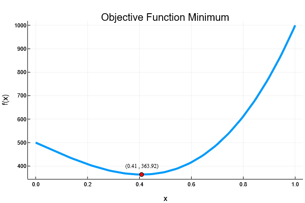

## Firm Choice:

##### Description:
This is hopefully the first in a series of economics related worked examples using Julia. This first example dabbles in the Optim.jl package for solving optimisation problems, applying it to a scenario where a firm needs to decide on its CO``_2`` abatement given an abatement cost function and a tax per ton of carbon. In light of the firm's choice, the net-present value of the firm's costs and estimated, and a case of Cournot competition is explored.

   

  

##### Code:
The code is contained within the Pluto notebook, and the Project.toml and Manifest.toml files provide the relevant information for setting up you local environment
