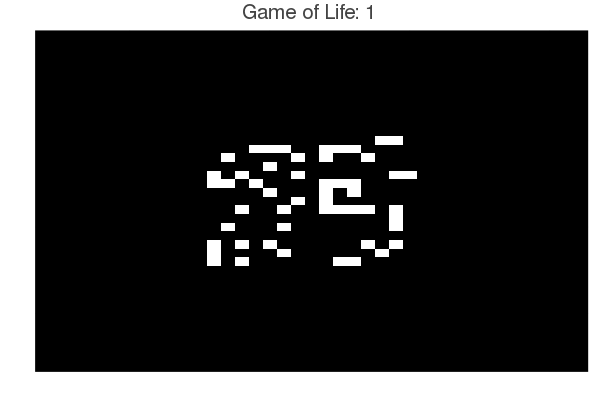

## Conway's Game of Life

##### Description:
Repository for a simulation of [Conway's Game of Life](https://en.wikipedia.org/wiki/Conway%27s_Game_of_Life) in Julia. The game serves as a simple cellular automation of how cells evolve. One of the beauties of this game is how such simple rules can result in a vast array of patterns, where tracable patterns evolve from seemingly chaos. The game only relies ona  few simple rules:

1. Any live cell with less than 2 neighbours dies from loneliness
2. Any live cell with two are three live neighbours lives to the next generation
3. Any cellAny cell with more than three live neighbours dies from overpopulation
4. Any dead cell which has exactly three live neighbours becomes a live cell from reproduction
   

  

##### Code:
The [GameOfLife.jl](GameOfLife.jl) file contains a series of functions for specifying the starting matrix, and solving the game of life. Additionally, the code for plotting and storing the results as a GIF are included. To activate the environment, just run `activate .` from the package manager while the present working directory is set to this folder.
