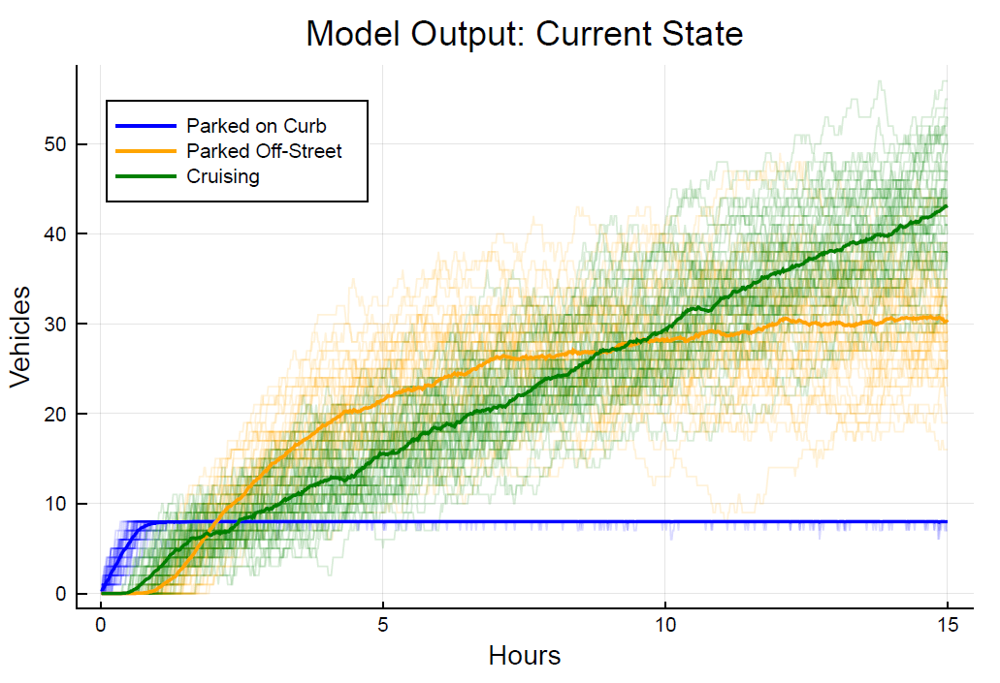

## Julia Implementations of *Parking for Cruising* (Shoup, 2006)

##### Description:
Simulating the model specified by ([Shoup, 2006](https://www.researchgate.net/publication/222745846_Cruising_for_parking)) on the externalities associated with cruising for parking. [ShoupModel.jl](ShoupModel.jl) contains the relevant functions for running the simulation and [model_notebook.jl](model_notebook.jl) is an interactive Pluto notebook, explaining the model and the Julia implementation. For users who do not have Pluto.jl installed, a static version of the notebook is also provided in pdf format.

The model highlights the potential triple-dividend from increasing curb-side prices. Namely, congestion reduction, pollution reduction, and raising government revenue. The main driver is the large discrepancy in the price of on-street versus off-street parking, which incentivises individuals to cruise around to look for parking. The purpose of the model was to provide some further insight on the topic, as well as acting as a useful excercise in Pluto and model development in Julia.

 

##### The model:
The main differences between the Julia implementation and the model as specified by Shoup(2006) is that model parameters can be specified as distributions. To account for the embedded variance in the model, a monte-carlo solver is also added (example output below). The modelling also takes a bottom-up approach, where each agents is assigned certain characteristics, and the model is then solved based on each agent's preferences.

  

  

##### Feedback:
Feedback is always more than welcome, feel free to either drop me an email or raise an issue here on github.
